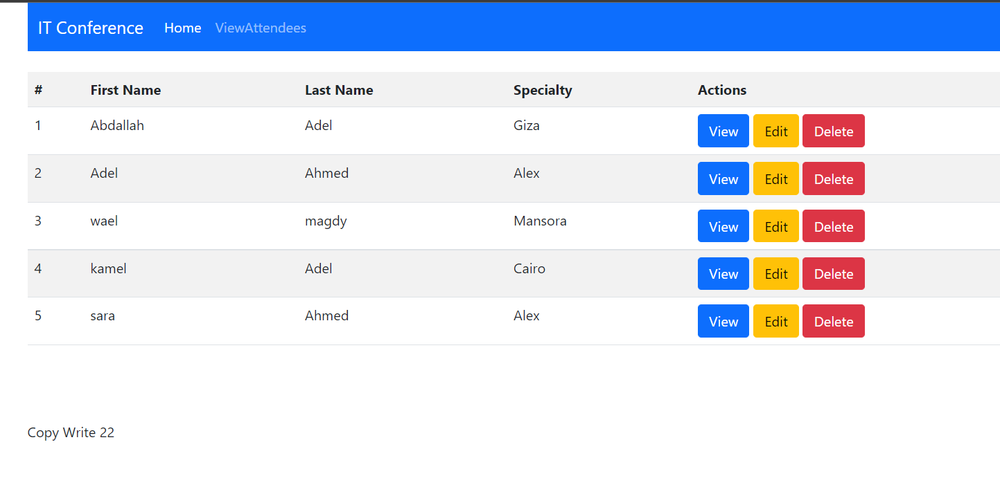

# Attendence
# Pharmacy-Management-System

# Installation
 Follow these steps to install the application.
1. Clone the Repository
```
git clone https://github.com/AbdallahAhmed0/Attendence.git
```
2. Create your database 

3. Import attendee_db.sql file in the database folder

4. Start the local server and browser to your app.


